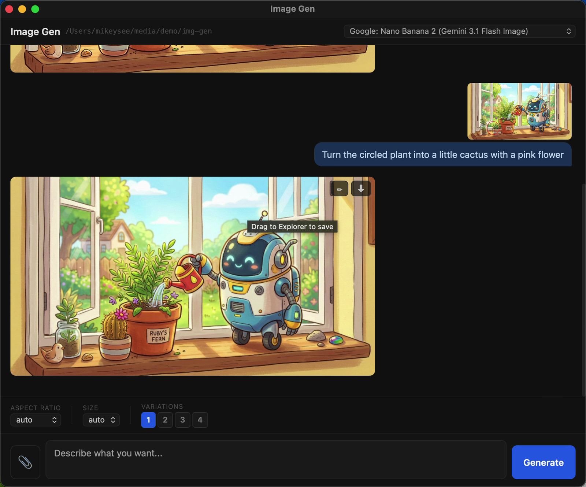

#  img-gen

A little chat window for making and refining images with Gemini

Windows · macOS

<!-- media: hero -->


[Watch it run (47 seconds, the waits are cut out)](docs/demo.mp4)
<!-- /media: hero -->

## What it is

Image Gen is a small desktop app where you describe an image and Gemini makes it, via OpenRouter. You open it on a folder, and when you like something you can drag it out or hit download to save it there.

The bit I like is that you can draw on a result, with pen, boxes, arrows and labels, and that annotated version gets used as the input for your next prompt. It's a nice way to say "change this bit here" without trying to describe it in words.

## Get it

Paste this into your AI coding agent (Claude Code, Codex, Cursor...):

> Clone https://github.com/mikecann/img-gen and make it my own. It's one of Mike
> Cann's personal tools, so read the README first, change anything specific to his
> setup to suit mine, then help me get it running.

### Or set it up by hand

You need [Bun](https://bun.sh), Git, and an [OpenRouter API key](https://openrouter.ai/keys) with credit for image generation. The macOS launcher also uses Python 3 to resolve its symlink. Electrobun downloads its native runtime during the first build, so that needs an internet connection.

```sh
git clone https://github.com/mikecann/img-gen.git
cd img-gen
```

Copy `.env.example` to `.env` in this folder and fill in `OPENROUTER_API_KEY`. Keep that file private.

On Windows, run this in PowerShell:

```powershell
Copy-Item .env.example .env
notepad .env
powershell -NoProfile -ExecutionPolicy Bypass -File .\install.ps1
```

The installer checks the key, installs Bun dependencies, converts the icon, and adds **Mike's Tools > Image Gen** to folder and folder-background context menus. It uses your user registry, so it doesn't need administrator permissions. `-SkipDeps` skips the dependency check and install if you've already done that yourself. Re-run the installer if you move the clone. It keeps other tools' menu entries.

On macOS:

```sh
cp .env.example .env
# Edit .env and add your key before launching.
bash install.sh --with-bun-install
```

This links `img-gen` into `~/.local/bin`. Add that directory to your shell's `PATH` if the installer asks. You can choose another directory with `bash install.sh /path/to/bin --with-bun-install`.

## Using it

On Windows, right-click a folder or the background of an open folder, then choose **Mike's Tools > Image Gen**. On Windows 11, open **Show more options** first. To launch it directly:

```powershell
wscript.exe .\img-gen.vbs "C:\path\to\images"
```

On macOS:

```sh
img-gen /path/to/images
```

The first launch builds the app. Later launches reuse the build.

Type a prompt and press Enter or click **Generate**. Shift+Enter adds a new line. You can attach a reference image, choose a model, aspect ratio and image size, and request one to four variations.

Click the pen on a result to annotate it, then **Done** to use those marks with your next prompt. Click download to save the result into the folder you opened, or drag it out to save it elsewhere.

## Development

```sh
bun install --frozen-lockfile
bun test
bunx tsc --noEmit
bun run build:dev
bun run dev
```

Rebuild after source changes. The launchers only build when `build/` is missing. For a development launch on a chosen folder, set `FOLDER_PATH` before `bun start`. Bun reads the clone's `.env` when run from this directory.

`src/bun/index.ts` owns the window, local image server, generation jobs and saving files. `src/bun/generation.ts` handles requests and model fallback, with mocked network tests in `tests/generation.test.ts`. The React UI is in `src/ui/`. Generation results arrive over server-sent events while window actions use Electrobun RPC.

Electrobun is pinned to 1.18.1 because this app uses its Bun and React API. Update it deliberately, with a build and launch check, rather than switching to `latest`.

## Troubleshooting

If the app reports a missing API key, check `.env` beside `package.json`, then close and relaunch it. You can also provide `OPENROUTER_API_KEY` as an environment variable.

If a model is rate-limited, the app tries the other built-in image models. Other errors appear in the chat. Generation requests time out after 90 seconds.

Logs are in `%TEMP%\img-gen\img-gen.log` on Windows and `/tmp/img-gen/img-gen.log` on macOS. Generated images are held in a temporary session folder until you download or drag them out. Chat state is held in memory, so save anything you want before closing the app.

## Uninstall

On Windows, run `powershell -NoProfile -ExecutionPolicy Bypass -File .\uninstall.ps1`. It removes only Image Gen's menu entries and generated icon. It keeps the shared submenu, other tools, your clone and `.env`.

On macOS, remove the installed symlink with `rm ~/.local/bin/img-gen`, or remove it from the custom bin directory you chose. Your clone and downloaded images stay where they are.

## More tools

My other tools are at [mikerosoft.app](https://mikerosoft.app).

MIT licensed.
